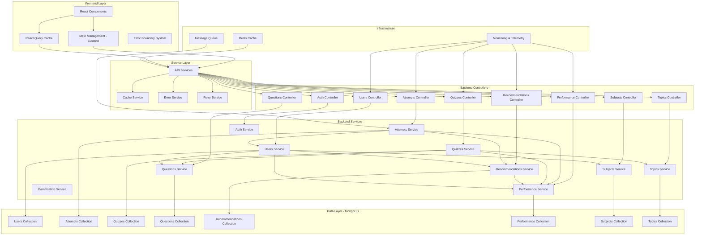
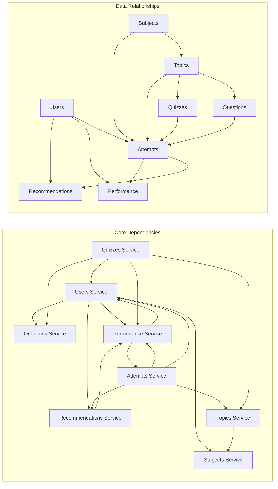
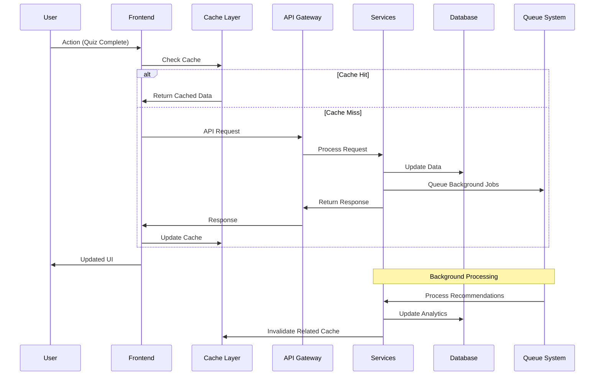
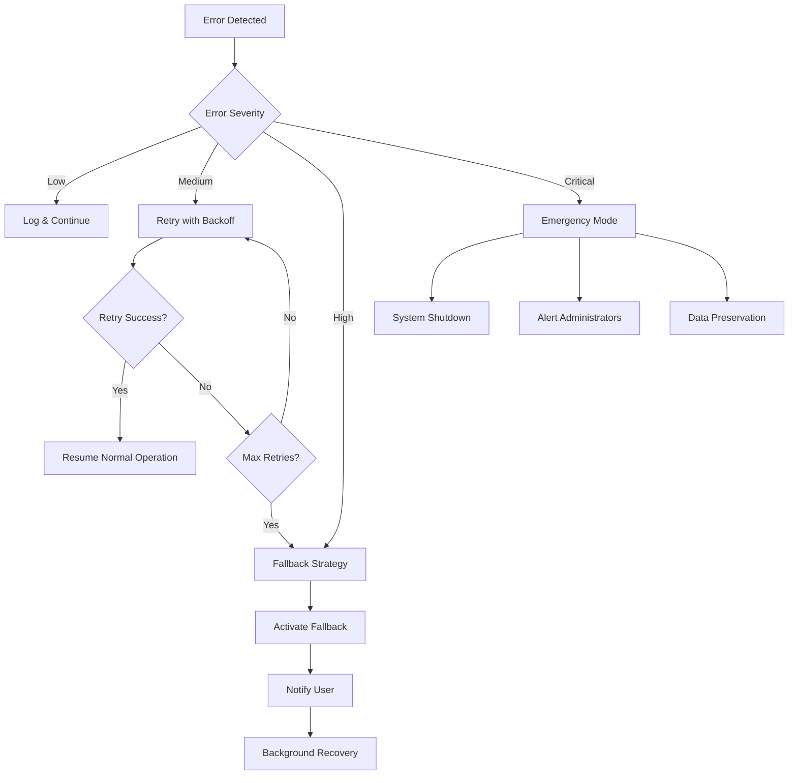

# Design Document

## Overview

This design addresses the critical reliability, performance, and data consistency issues in the EduAssist platform by implementing a comprehensive enhancement strategy. The solution focuses on creating a robust, scalable architecture with intelligent error handling, optimized data flow, and enhanced user experience. 

**Key Design Principles:**
- **Reliability First**: All systems designed with failure scenarios in mind, implementing automatic recovery and graceful degradation
- **Performance Optimization**: Sub-2 second response times for critical operations with intelligent caching and resource management
- **Data Consistency**: Guaranteed accuracy across all user interactions with conflict resolution and synchronization mechanisms
- **Scalable Foundation**: Architecture designed to handle growth from hundreds to thousands of concurrent users
- **Clean Architecture**: Elimination of technical debt through systematic code cleanup and standardization

The design directly addresses all 10 requirement categories: reliable recommendations, accurate performance tracking, consistent data fetching, system performance optimization, dead code elimination, enhanced error handling, intelligent synchronization, advanced analytics, scalable architecture, and comprehensive testing.

## Architecture

### Complete System Architecture with All Modules



### Service Dependencies and Data Flow



### Data Flow Architecture



## Components and Interfaces

### 1. Enhanced Error Handling System

#### Error Boundary Component
```typescript
interface ErrorBoundaryState {
  hasError: boolean
  error: Error | null
  errorInfo: ErrorInfo | null
  retryCount: number
}

interface ErrorRecoveryStrategy {
  canRecover: (error: Error) => boolean
  recover: (error: Error) => Promise<void>
  maxRetries: number
}
```

#### Service Error Handler
```typescript
interface ServiceError {
  code: string
  message: string
  severity: 'low' | 'medium' | 'high' | 'critical'
  recoverable: boolean
  context: Record<string, any>
  timestamp: Date
}

interface RetryConfig {
  maxRetries: number
  baseDelay: number
  maxDelay: number
  backoffFactor: number
  retryCondition: (error: Error) => boolean
}
```

### 2. Intelligent Caching System

#### Cache Manager Interface
```typescript
interface CacheManager {
  get<T>(key: string): Promise<T | null>
  set<T>(key: string, value: T, ttl?: number): Promise<void>
  invalidate(pattern: string): Promise<void>
  invalidateGroup(group: string): Promise<void>
  prefetch(keys: string[]): Promise<void>
}

interface CacheStrategy {
  key: string
  ttl: number
  group: string
  dependencies: string[]
  invalidationTriggers: string[]
}
```

### 3. Performance Monitoring System

#### Performance Tracker
```typescript
interface PerformanceMetrics {
  responseTime: number
  cacheHitRate: number
  errorRate: number
  throughput: number
  userSatisfactionScore: number
}

interface PerformanceThreshold {
  metric: keyof PerformanceMetrics
  warning: number
  critical: number
  action: () => void
}
```

### 4. Enhanced Recommendation Engine

**Design Rationale**: The recommendation system is redesigned to meet the 2-second generation requirement while providing intelligent, prioritized suggestions with clear reasoning.

#### Recommendation Generator
```typescript
interface RecommendationContext {
  userId: string
  performanceHistory: PerformanceData[]
  learningPreferences: UserPreferences
  currentWeakAreas: WeakArea[]
  timeConstraints: TimeConstraints
  recentActivity: ActivityData[]
  learningVelocity: number
}

interface RecommendationAlgorithm {
  name: string
  weight: number
  priority: number
  generate: (context: RecommendationContext) => Promise<Recommendation[]>
  validate: (recommendation: Recommendation) => boolean
  estimateCompletionTime: (recommendation: Recommendation) => number
}

interface RecommendationService {
  generateRecommendations: (userId: string) => Promise<Recommendation[]>
  getFallbackRecommendations: (userId: string) => Promise<Recommendation[]>
  prioritizeRecommendations: (recommendations: Recommendation[]) => Recommendation[]
  trackRecommendationEffectiveness: (recommendationId: string, outcome: string) => void
}
```

### 5. Data Synchronization Manager

**Design Rationale**: Implements cross-device synchronization with 5-second consistency guarantee and automatic conflict resolution using timestamp-based strategies.

#### Sync Manager Interface
```typescript
interface SyncManager {
  queueUpdate(entity: string, id: string, data: any): void
  processQueue(): Promise<void>
  resolveConflicts(conflicts: DataConflict[]): Promise<void>
  getStatus(): SyncStatus
  enableOfflineMode(): void
  syncOfflineActions(): Promise<void>
}

interface DataConflict {
  entity: string
  id: string
  localVersion: any
  remoteVersion: any
  timestamp: Date
  resolutionStrategy: 'timestamp' | 'merge' | 'manual'
  deviceId: string
}

interface OfflineActionQueue {
  actions: OfflineAction[]
  addAction: (action: OfflineAction) => void
  processActions: () => Promise<void>
  clearProcessedActions: () => void
}
```

### 6. Advanced Analytics Engine

**Design Rationale**: Provides comprehensive learning insights with trend analysis, peer benchmarking, and proactive intervention suggestions while maintaining user privacy.

#### Analytics Service Interface
```typescript
interface AnalyticsEngine {
  generateInsights: (userId: string) => Promise<LearningInsights>
  detectLearningPatterns: (performanceData: PerformanceData[]) => LearningPattern[]
  calculateTrends: (userId: string, timeframe: string) => Promise<TrendAnalysis>
  generatePeerBenchmarks: (userId: string) => Promise<BenchmarkData>
  detectPerformanceDecline: (userId: string) => Promise<InterventionSuggestion[]>
}

interface LearningInsights {
  strengths: string[]
  weaknesses: string[]
  learningVelocity: number
  consistencyScore: number
  recommendedActions: ActionRecommendation[]
  milestones: Milestone[]
}
```

### 7. Dead Code Elimination System

**Design Rationale**: Systematic approach to identify and remove unused code, consolidate duplicates, and standardize patterns to improve performance and maintainability.

#### Code Analysis Interface
```typescript
interface CodeAnalyzer {
  scanUnusedComponents: () => Promise<UnusedComponent[]>
  identifyDuplicates: () => Promise<DuplicateCode[]>
  findUnusedEndpoints: () => Promise<UnusedEndpoint[]>
  analyzePatternInconsistencies: () => Promise<PatternInconsistency[]>
}

interface CleanupStrategy {
  removeUnusedCode: (components: UnusedComponent[]) => Promise<void>
  consolidateDuplicates: (duplicates: DuplicateCode[]) => Promise<void>
  standardizePatterns: (inconsistencies: PatternInconsistency[]) => Promise<void>
  optimizeBundleSize: () => Promise<BundleOptimization>
}
```

## Data Models

### Enhanced User Performance Model
```typescript
interface EnhancedUserPerformance {
  id: string
  userId: string
  topicId: string
  subjectId: string
  
  // Core Metrics
  totalAttempts: number
  averageScore: number
  bestScore: number
  worstScore: number
  recentScores: number[]
  
  // Advanced Analytics
  masteryLevel: number
  learningVelocity: number
  progressTrend: 'improving' | 'declining' | 'steady'
  consistencyScore: number
  
  // Predictive Metrics
  projectedMastery: number
  estimatedTimeToMastery: number
  riskFactors: string[]
  
  // Metadata
  lastUpdated: Date
  dataQuality: number
  confidenceScore: number
}
```

### Intelligent Recommendation Model
```typescript
interface IntelligentRecommendation {
  id: string
  userId: string
  
  // Core Properties
  type: 'quiz' | 'topic' | 'study_plan' | 'review'
  title: string
  description: string
  reason: string
  
  // Intelligence Metrics
  priority: number // 0-100
  urgency: number // 0-100
  confidence: number // 0-1
  effectiveness: number // Historical success rate
  
  // Personalization
  difficulty: 'easy' | 'medium' | 'hard'
  estimatedTime: number
  prerequisites: string[]
  learningStyle: string[]
  
  // Context
  generatedBy: string // Algorithm name
  basedOn: string[] // Data sources used
  validUntil: Date
  
  // Tracking
  status: 'pending' | 'accepted' | 'dismissed' | 'completed'
  interactions: RecommendationInteraction[]
  
  // Metadata
  createdAt: Date
  updatedAt: Date
  version: number
}
```

### Performance Analytics Model
```typescript
interface PerformanceAnalytics {
  userId: string
  timeframe: 'daily' | 'weekly' | 'monthly' | 'all-time'
  
  // Aggregated Metrics
  totalQuizzes: number
  averageScore: number
  improvementRate: number
  streakData: StreakAnalytics
  
  // Subject Breakdown
  subjectPerformance: SubjectPerformance[]
  strongAreas: PerformanceArea[]
  weakAreas: PerformanceArea[]
  
  // Trend Analysis
  scoreTrend: TrendData[]
  velocityTrend: TrendData[]
  engagementTrend: TrendData[]
  
  // Predictive Insights
  projectedPerformance: ProjectedMetrics
  recommendedActions: ActionRecommendation[]
  
  // Metadata
  calculatedAt: Date
  dataFreshness: number
  reliability: number
}
```

## Error Handling

### Comprehensive Error Strategy

#### 1. Error Classification System
```typescript
enum ErrorSeverity {
  LOW = 'low',           // UI glitches, non-critical features
  MEDIUM = 'medium',     // Feature degradation, performance issues
  HIGH = 'high',         // Core functionality affected
  CRITICAL = 'critical'  // System-wide failure, data corruption
}

enum ErrorCategory {
  NETWORK = 'network',
  VALIDATION = 'validation',
  AUTHENTICATION = 'authentication',
  AUTHORIZATION = 'authorization',
  DATA_INTEGRITY = 'data_integrity',
  PERFORMANCE = 'performance',
  EXTERNAL_SERVICE = 'external_service'
}
```

#### 2. Retry Mechanisms
```typescript
interface RetryStrategy {
  exponentialBackoff: {
    baseDelay: 1000,
    maxDelay: 30000,
    backoffFactor: 2,
    jitter: true
  },
  circuitBreaker: {
    failureThreshold: 5,
    recoveryTimeout: 60000,
    monitoringPeriod: 10000
  },
  bulkhead: {
    maxConcurrentRequests: 10,
    queueTimeout: 5000
  }
}
```

#### 3. Graceful Degradation
```typescript
interface FallbackStrategy {
  cacheFirst: boolean
  offlineMode: boolean
  reducedFunctionality: string[]
  userNotification: NotificationConfig
}
```

### Error Recovery Workflows



## Testing Strategy

### 1. Unit Testing Enhancement
- **Coverage Target**: 90% for critical paths, 80% overall
- **Test Categories**: 
  - Pure functions and utilities
  - Service layer methods
  - Error handling scenarios
  - Cache operations
  - Data transformations

### 2. Integration Testing
- **API Integration**: All service endpoints with various scenarios
- **Database Integration**: CRUD operations with edge cases
- **Cache Integration**: Cache hit/miss scenarios
- **Error Propagation**: End-to-end error handling

### 3. Performance Testing
- **Load Testing**: Concurrent user scenarios
- **Stress Testing**: System limits and breaking points
- **Endurance Testing**: Long-running operations
- **Spike Testing**: Sudden load increases

### 4. User Journey Testing
- **Critical Paths**: Login → Quiz → Results → Recommendations
- **Error Scenarios**: Network failures, timeout handling
- **Cross-Device**: Data synchronization testing
- **Accessibility**: Screen reader and keyboard navigation

## Implementation Phases

### Phase 1: Foundation (Weeks 1-2)
1. **Error Handling Infrastructure**
   - Implement comprehensive error boundary system
   - Create service-level error handlers
   - Set up retry mechanisms with exponential backoff

2. **Caching System Enhancement**
   - Implement intelligent cache invalidation
   - Add cache warming strategies
   - Create cache performance monitoring

### Phase 2: Core Reliability (Weeks 3-4)
1. **Data Consistency Improvements**
   - Implement optimistic updates with rollback
   - Add data validation layers
   - Create conflict resolution mechanisms

2. **Performance Optimization**
   - Optimize database queries with proper indexing
   - Implement request deduplication
   - Add response compression and pagination

### Phase 3: Intelligence Layer (Weeks 5-6)
1. **Enhanced Recommendation Engine**
   - Implement multi-algorithm recommendation system
   - Add machine learning-based personalization
   - Create recommendation effectiveness tracking

2. **Advanced Analytics**
   - Implement real-time performance tracking
   - Add predictive analytics capabilities
   - Create comprehensive dashboard insights

### Phase 4: Monitoring & Optimization (Weeks 7-8)
1. **Comprehensive Monitoring**
   - Implement application performance monitoring
   - Add user experience tracking
   - Create automated alerting systems

2. **Dead Code Elimination**
   - Identify and remove unused components
   - Consolidate duplicate functionality
   - Optimize bundle size and loading performance

## Performance Targets

### Response Time Targets
- **Page Load**: < 2 seconds (95th percentile)
- **API Responses**: < 500ms (average)
- **Cache Operations**: < 50ms (average)
- **Database Queries**: < 200ms (95th percentile)

### Reliability Targets
- **Uptime**: 99.9% availability
- **Error Rate**: < 0.1% for critical operations
- **Data Consistency**: 100% for user progress data
- **Cache Hit Rate**: > 80% for frequently accessed data

### Scalability Targets
- **Concurrent Users**: Support 1000+ simultaneous users
- **Database Performance**: Handle 10,000+ queries per minute
- **Memory Usage**: < 512MB per user session
- **CPU Utilization**: < 70% under normal load

## Security Considerations

### Data Protection
- **Encryption**: All sensitive data encrypted at rest and in transit
- **Access Control**: Role-based permissions with principle of least privilege
- **Audit Logging**: Comprehensive logging of all data access and modifications
- **Data Validation**: Input sanitization and output encoding

### API Security
- **Authentication**: JWT tokens with proper expiration and refresh
- **Rate Limiting**: Prevent abuse and ensure fair resource usage
- **CORS Configuration**: Proper cross-origin resource sharing setup
- **Input Validation**: Comprehensive validation of all API inputs

## Monitoring and Observability

### Application Metrics
- **Performance Metrics**: Response times, throughput, error rates
- **Business Metrics**: User engagement, completion rates, satisfaction scores
- **Infrastructure Metrics**: CPU, memory, disk, network utilization
- **Custom Metrics**: Recommendation effectiveness, learning velocity

### Logging Strategy
- **Structured Logging**: JSON format with consistent fields
- **Log Levels**: DEBUG, INFO, WARN, ERROR, FATAL
- **Correlation IDs**: Track requests across service boundaries
- **Sensitive Data**: Proper redaction of personal information

### Alerting Rules
- **Critical Alerts**: System failures, data corruption, security breaches
- **Warning Alerts**: Performance degradation, high error rates
- **Info Alerts**: Deployment notifications, maintenance windows
- **Escalation**: Automated escalation based on severity and response time